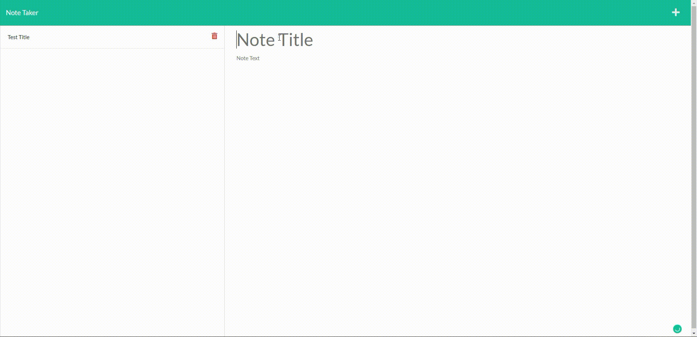

# Express Note Taker

    
## Table of Contents
- [Description](#description)
- [Installation](#installation)
- [Usage](#usage)
- [Contributions](#contributions)
- [Contributing](#contributing)
- [Tests](#tests)
- [Questions](#questions)

## Description
Server based note taker web application deployed in heroku.

## Installation
If you want to run it through a local server, clone or download the repository. Then in your terminal input ["npm i express"](https://expressjs.com/) and ["npm i uuid"](https://www.npmjs.com/package/uuid) You can also visit the [Express Note Taker](https://enigmatic-cliffs-34495.herokuapp.com/) with no install necessary!

## Usage 
To take notes saved in a server that is accessible every where you go!

## Contributing 
No need to contact for pull and fork requests! Go forth!

## Tests
Create a test note and click the save button. If you see your saved note title on the sidebar, app is functioning as expected!

## Screenshot

## GitHub and Contact
GitHub: [github.com/rheneadianne](https://github.com/rheneadianne)
Email:  [rheneadianne@gmail.com](mailto:rheneadianne@gmail.com)

## Contribution
Made with ❤️ by rhenea
